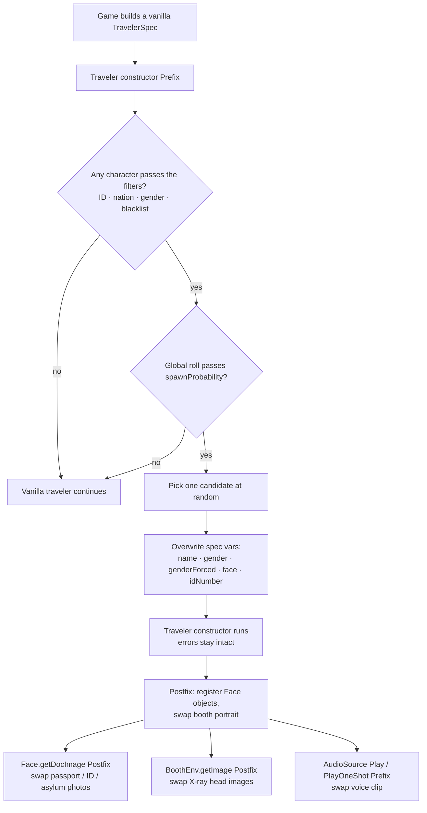

# Custom Traveler Engine for *Papers, Please*

> Inject fully custom characters — names, ID numbers, portraits, document photos, X-ray heads and voice lines — into the game's procedural traveler queue **without breaking the rules of Arstotzka**.


---

## Table of contents

1. [What is it?](#what-is-it)
2. [Requirements](#requirements)
3. [Installation](#installation)
4. [Creating a Custom Traveler (quick start)](#creating-a-custom-traveler-quick-start)
5. [Global configuration: `ct.conf`](#global-configuration-ctconf)
6. [Character JSON reference](#character-json-reference)
7. [Assets: images and audio](#assets-images-and-audio)
8. [The `face` property (FaceSpec DNA)](#the-face-property-facespec-dna)
9. [The Traveler Scraper (dev tool)](#the-traveler-scraper-dev-tool)
10. [How the engine chooses who appears](#how-the-engine-chooses-who-appears)
11. [How it works internally](#how-it-works-internally)
12. [What I learned: the anatomy of Arstotzka](#what-i-learned-the-anatomy-of-arstotzka)
13. [Troubleshooting](#troubleshooting)
14. [Known limitations](#known-limitations)
15. [Building from source](#building-from-source)
16. [Disclaimer & credits](#disclaimer--credits)

---

## What is it?

The **Custom Traveler Engine** is a dynamic modding framework for *Papers, Please* that I made so creators can add their own characters to the normal game loop. A custom character can show up with an expired passport one day and a missing work permit the next, exactly like any other traveler, because the game's own rule and error system keeps driving them.

It does **not** rely on hardcoded events or static replacements. I went for a *parasitic hybrid* approach instead:

1. The game generates a normal ("vanilla") traveler, including the errors and discrepancies the player will have to find.
2. The engine checks that traveler against the filters of every installed custom character.
3. If one matches, the engine **overwrites only what the character's JSON defines** (name, ID number, face code, portraits, voice…) and leaves everything else — especially the generated errors — untouched.

> **My design rule:** the engine never creates a traveler from scratch. Everything you don't override stays vanilla.

This repository contains two mods:

| Mod | Purpose |
|---|---|
| **Custom Traveler Engine** v1.9.0 (`CustomTravelerEngine/Plugin.cs`) | The actual mod. Loads characters from `Mods/CustomTravelers/` and injects them. |
| **Definitive Traveler Scraper** v2.0.0 (`TravelerScraper/Plugin.cs`) | A **read-only developer tool** I wrote to dump what the game generates (IDs, nations, errors, face codes) so you know which values to put in your JSON. |

---

## Requirements

| | |
|---|---|
| **Game** | *Papers, Please* **v1.4.11.124** (Steam or GOG) — the modern Unity port |
| **OS** | Windows (x64) |
| **Mod loader** | [MelonLoader](https://github.com/LavaGang/MelonLoader/releases) **v0.7.3 (x64)** |

MelonLoader download: `MelonLoader.x64.zip` from the **official LavaGang repository** (release v0.7.3, published 14 May).
SHA-256: `5b2b2f3d1cd42b59ec886c5bdc2663edae87a0097a4f4a8f58c0965a99dda416`

> ⚠️ Only download MelonLoader from `github.com/LavaGang/MelonLoader`. Copies hosted under other accounts are not official. Compare the checksum before installing (`Get-FileHash .\MelonLoader.x64.zip -Algorithm SHA256` in PowerShell).

---

## Installation

### 1. Install MelonLoader

Either use the official [MelonLoader Installer](https://github.com/LavaGang/MelonLoader.Installer) and select the game, or extract `MelonLoader.x64.zip` into the game folder (next to `PapersPlease.exe`).

Launch the game **once**. MelonLoader will generate its Il2Cpp assemblies (this first start takes a while) and create the `Mods/` folder.

### 2. Install the engine

Download `CustomTravelerEngine.dll` from the [Releases](../../releases) page (or [build it yourself](#building-from-source)) and copy it into `Mods/`, then launch the game again. On first launch the engine creates:

- `Mods/ct.conf` — global configuration
- `Mods/CustomTravelers/` — the folder where characters go

### 3. Add characters

Drop each character's folder into `Mods/CustomTravelers/`.

```text
Papers, Please/
├── PapersPlease.exe
├── MelonLoader/
└── Mods/
    ├── CustomTravelerEngine.dll      ← the engine
    ├── TravelerScraper.dll           ← optional dev tool (see below)
    ├── ct.conf                       ← global config (auto-generated)
    ├── TemaPrincipal.wav             ← optional: replaces the main theme
    └── CustomTravelers/
        ├── JorjiTheSecond/
        │   ├── JorjiTheSecond.json   ← MUST match the folder name
        │   ├── custom_face.png
        │   ├── passport_photo.png
        │   └── custom_voice.wav
        └── AlienVisitor/
            ├── AlienVisitor.json
            └── alien_sprite.png
```

**Rules**

- One folder per character, directly inside `Mods/CustomTravelers/`.
- The JSON must be named exactly like its folder: `Folder_Name/Folder_Name.json`. **A folder whose JSON doesn't match is silently ignored.**
- Every `.png` / `.wav` referenced by the JSON is looked up **relative to that character's folder**.
- Characters, textures and audio are loaded **once, when the game starts**. Restart the game after changing anything.

---

## Creating a Custom Traveler (quick start)

1. Copy `examples/Sample/` to `Mods/CustomTravelers/MyCharacter/` and rename `Sample.json` to `MyCharacter.json`.
2. Edit the JSON. Start from [`Sample.json`](examples/Sample/Sample.json) (clean and loadable) and read [`Sample_annotated.jsonc`](examples/Sample/Sample_annotated.jsonc) for an explanation of every field.
3. Put your images and audio next to the JSON and reference them by filename.
4. Make sure `"verboseDebug": true` is set in `ct.conf` and launch the game.
5. Watch the MelonLoader console (or `MelonLoader/Latest.log`). For every traveler the engine prints an `=== EVALUATING NPC #N ===` block with the vanilla traveler's data, followed by either `Verdict NPC #N: <name> SELECTED and ready for injection!` or `Traveler #N -> REJECTED` with a `Reason:` line. That tells you exactly why your character did or didn't appear.
6. To find the right `face` code, `acceptedIDs`, error keywords, etc., use the [Scraper](#the-traveler-scraper-dev-tool).

> ⚠️ **Delete (or rename) the Sample folder when you're done with it.** It is a fully working character, so while it's installed it will really show up in your games.

> 💡 **The character JSON is parsed leniently:** `//` and `/* */` comments and trailing commas are allowed. Property names are **case-sensitive** (`texTraveler`, not `textraveler`), and a misspelled property is **silently ignored**. Invalid JSON (a missing quote, comma or bracket) makes the character fail to load with an `Error parsing <name>.json` message.

---

## Global configuration: `ct.conf`

Generated automatically in `Mods/` on first launch. It is plain JSON (comments allowed):

```json
{
  "verboseDebug": true,
  "spawnProbability": 100
}
```

| Key | Type | Default | Description |
|---|---|---|---|
| `verboseDebug` | `true` / `false` | `true` | Prints detailed engine logs: every traveler evaluated, why it was accepted/rejected, every image injected. Keep it `true` while developing; set it to `false` for normal play. |
| `spawnProbability` | `0`–`100` | `100` | Percentage chance that a custom character is injected **once at least one character has passed its filters**. `100` = always, `0` = never. |

The engine also looks for an optional `Mods/TemaPrincipal.wav`, which replaces the game's main theme (see [Audio](#audio)).

If `ct.conf` can't be parsed, the engine logs `Error reading ct.conf` and runs with the defaults above. Delete the file to have it regenerated.

---

## Character JSON reference

Every field is optional. Defaults for omitted fields are listed below.

The file has two conceptual parts:

- **Filters** decide *which vanilla travelers may be replaced.* They never modify the traveler.
- **Data & assets** are the overrides applied *after* the character has been selected.

An **empty string `""` means "keep the vanilla value"**.

### Filters

| Field | Type | Default if omitted | Description |
|---|---|---|---|
| `acceptedIDs` | string[] | `["GENERIC"]` | The vanilla traveler's internal ID must **start with** one of these strings (case-insensitive). `"ANY"` disables the check entirely. Use `"GENERIC"` for normal characters: it keeps you away from special/story NPCs. |
| `acceptedNations` | string[] | `["ALL"]` | The vanilla traveler's nation must **equal** one of these (case-insensitive). `"ALL"` ignores nationality. Known names: `Arstotzka`, `Obristan`, `Impor`, `UnitedFed`, `Antegria`, `Republia`, `Kolechia`. |
| `requiredGender` | `"M"` / `"F"` / `"X"` | `"X"` | The **original** gender of the vanilla traveler. `"X"` (or `"ALL"`, or `""`) ignores gender. This is a *filter*, not an override (see [gender](#a-note-on-gender)). |
| `blacklistedKeywords` | string[] | `[]` (nothing blacklisted) | If any keyword appears (case-insensitive substring) in the vanilla traveler's error ID, error group ID or internal spec error, the traveler is **not** replaced. |

Notes:

- **Don't combine `"ANY"` / `"ALL"` with specific values.** `["GENERIC", "ANY"]` is the same as `["ANY"]` because a single `"ANY"` wins. Pick one.
- An **empty array** (`[]`) means "no restriction" for `acceptedIDs` and `acceptedNations`, and "no blacklist" for `blacklistedKeywords`.
- **There is no built-in blacklist.** If you omit `blacklistedKeywords`, nothing is filtered out by error. I recommend always setting it, and at least `"criminal"` (see below).
- **Keep `"criminal"` in the blacklist.** Otherwise the "Wanted criminals" can get their face replaced by your character, which makes them effectively undetectable unless the player uses Inspection Mode.
- Story NPCs are meant to be left alone. The reliable protection is the `acceptedIDs` filter (`"GENERIC"`), so avoid `"ANY"` unless you know what you're doing.

### Custom data

| Field | Type | Description |
|---|---|---|
| `name` | string | `"First-Last"`. First and last name are separated by `-`. Example: `"John-Smith"`. |
| `gender` | `"M"` / `"F"` | The gender written onto the traveler. Only applied together with `genderForced`, see below. |
| `genderForced` | `"YES"` / `""` | Flag that forces `gender` onto the traveler. |
| `face` | string | The game's face DNA: `Gender-Shoulders-Head-Eyes-NoseMouth-Palette`, e.g. `"M-18-4-5-3-4"`. See [The `face` property](#the-face-property-facespec-dna). |
| `idNumber` | string | Identification number used across the traveler's documents (passport, ID card…). |

#### A note on gender

`requiredGender` and `gender`/`genderForced` do different jobs:

- `requiredGender` **selects** vanilla travelers by their *original* gender.
- `gender` + `genderForced` **rewrite** the traveler's gender.

Why it matters: if the vanilla traveler has a *wrong-gender* error on its passport and you force a different gender, the passport will show your forced gender. The error still exists internally but is no longer visible on the document (it can only be found via Inspection Mode).

Two safe patterns:

```jsonc
// A) Only replace vanilla males; don't touch gender at all
"requiredGender": "M", "gender": "", "genderForced": "",

// B) Replace anyone and force the gender — blacklist gender errors!
"requiredGender": "X", "gender": "M", "genderForced": "YES",
"blacklistedKeywords": ["criminal", "Gender"]   // "Gender" also matches WrongGender / ConfusingGender
```

### Asset fields

| Field | Used for | Expected size |
|---|---|---|
| `texTraveler` | Portrait shown at the booth | 150×120 |
| `texPassport` | Passport photo | 40×48 |
| `texDni` | Arstotzkan ID card photo | 32×38 |
| `texAsylum` | Asylum / diplomatic document photo | 60×72 |
| `texFallback` | Photo for any document type without its own image | any |
| `texScannerFront` | Front head image in the X-ray scanner | 50x50 |
| `texScannerBack` | Back head image in the X-ray scanner |50x50|
| `customVoiceClip` | Replaces the traveler's speech sound | `.wav` (PCM 8/16-bit) |

Paths are relative to the character's folder. If a value is `""`, or the file doesn't exist, **the vanilla asset is kept** (no error is shown — check the filename if an asset doesn't appear).

---

## Assets: images and audio

### Images

- Format: **PNG**, transparency supported.
- The engine reads each PNG and converts it into the game's native image format. If the size differs from what the game asks for, the image is **stretched with nearest-neighbour sampling** to the required size. It **does not preserve aspect ratio**, so supplying the exact resolution is strongly recommended (pixel art will otherwise be distorted).
- Which image goes where:

| Where | Selected by |
|---|---|
| Booth portrait | `texTraveler` |
| Passport photo | `texPassport` — chosen when the game asks for a **40×48** image |
| ID card photo | `texDni` — **32×38** |
| Asylum/diplomatic photo | `texAsylum` — **60×72** |
| Any other document photo size | `texFallback` |
| Missing individual texture for a known size | falls back to `texFallback`, and if that's missing too, vanilla |
| X-ray head (front / back) | `texScannerFront` / `texScannerBack`. Only the **head** is replaced; the game still draws the body |

- With `verboseDebug` on, every injection prints a line such as `[IMAGE] Game requested photo for Passport (40x48). Injecting source image of WxH squashed to WxH.` or `[SCANNER] Game requested HeadFront. Original resolution: WxH. …`. That's the quickest way to find out the exact resolution the game requests for each slot (including the scanner heads).
- If you don't provide `texTraveler`, the procedural face generated from the `face` code is shown instead (the engine prints a note about it at startup).

### Audio

- Format: **`.wav`, uncompressed PCM, 8-bit or 16-bit** (any sample rate, mono or stereo). Float, 24/32-bit, ADPCM, MP3 and OGG are **not** supported and will be silently ignored.
- **`customVoiceClip`** replaces the game's `speech-entrant` sound while your character is at the booth.
- **`Mods/TemaPrincipal.wav`** (optional, global) replaces the game's `Theme` music for everyone. Same WAV requirements.

---

## The `face` property (FaceSpec DNA)

`face` is the exact DNA string the game uses to procedurally build a traveler's appearance. This format was **not invented for this mod** — it is how the base game encodes faces. It has six dash-separated segments that map to the game's internal `FaceSpec` fields:

```
[Gender]-[Shoulders]-[Head]-[Eyes]-[NoseMouth]-[Palette]
```

Example: `"face": "M-18-4-5-3-4"`

| Segment | Value | Controls |
|---|---|---|
| Gender | `M` | Base model (`M` male / `F` female) |
| Shoulders | `18` | Clothing style and body shape (there are 3 body types) |
| Head | `4` | Head shape, hairstyle and hair accessories (hats…) |
| Eyes | `5` | Eye shape, eyebrows and eyewear (glasses…) |
| NoseMouth | `3` | Nose and mouth. For males, also facial hair (beards, moustaches) |
| Palette | `4` | Colour palette: skin tone and hair colour |

The engine doesn't interpret these numbers: it hands the string to the game as-is.

### Why it matters even if you use custom images

Even if you replace the visuals with `texTraveler`, **the game's logic still reads the face code** to decide the traveler's physical traits. If your image shows a bearded man with glasses but the `face` code describes a clean-shaven man without glasses, the game will treat him as clean-shaven — causing contradictions with documents such as the ID supplement or the access permit.

### How to get a matching code

1. **Scraper method (recommended):** play with the [Scraper](#the-traveler-scraper-dev-tool) installed until the game generates a traveler that *looks like your character* (e.g. beard + glasses). In the console, find `PHASE 3: FACE & FACESPEC` and copy the `"face": "…"` line.
2. **Trial and error:** edit the numbers in your JSON, restart the game, and watch how the procedural face changes until it matches your art.

> The `flip` value shown by the Scraper is **not** part of the face string.

---

## The Traveler Scraper (dev tool)

`TravelerScraper/Plugin.cs` builds the **Definitive Traveler Scraper**, a *read-only* MelonLoader mod I wrote while mapping the game's traveler system. It changes nothing in the game; it only logs what the game generates. Use it to discover valid values for your JSON.

**Install:** copy `TravelerScraper.dll` into `Mods/`. It can run alongside the engine.
**Output:** MelonLoader console and `MelonLoader/Latest.log`.

For every traveler, the scraper prints three blocks:

| Phase | Hooked method | What it prints |
|---|---|---|
| **1 – SEED** | `TravelerContext.makeTravelerSpec` (postfix) | Internal ID, spec error, custom error ID, **all native variables** (`vars`), and a banner if it's a special story NPC |
| **2 – ERRORS** | `Traveler` constructor (prefix) | The generated error's **ID** and **group** |
| **3 – FACE** | `Traveler` constructor (postfix) | Every `FaceSpec` field and the ready-to-paste `"face": "…"` string |

Illustrative output shape (values will differ):

```text
========== [NPC #12] PHASE 1: SEED ==========
[INTERNAL ID] <id>
[SPEC ERROR] <error or None>

--- NATIVE VARIABLES (VARS) ---
[nation] = <nation>
[gender] = <M/F>
[name] = <…>
… (all other variables)

========== [NPC #12] PHASE 2: ERRORS ==========
[ERROR ID] <id>
[ERROR GROUP] <group>

========== [NPC #12] PHASE 3: FACE & FACESPEC ==========
--- JSON FACE STRING ---
"face": "M-18-4-5-3-4"
```

> 💡 **Scraping while the engine is installed:** if one of your characters replaces a traveler, phases 2 and 3 can show the *injected* data instead of the vanilla one. To capture clean vanilla values, set `"spawnProbability": 0` in `ct.conf` while you scrape (or remove the engine temporarily).

### Where each JSON value comes from

The engine's own `[X-RAY]` lines (printed in the `=== EVALUATING NPC #N ===` block when `verboseDebug` is on) already show the filter-related values. The Scraper adds the full variable dump and the face code.

| JSON field | Look for this in the scraper output |
|---|---|
| `acceptedIDs` | `[INTERNAL ID]` — use a prefix of it (engine: `[X-RAY] Traveler ID`) |
| `acceptedNations` | `[nation]` in the native variables (engine: `[X-RAY] Original Nation`) |
| `requiredGender` | `[gender]` in the native variables (engine: `[X-RAY] Original Gender`) |
| `blacklistedKeywords` | `[SPEC ERROR]`, `[ERROR ID]`, `[ERROR GROUP]` — any word contained in them (engine: `[X-RAY] Internal Spec Error / Error ID / Error Group ID`) |
| `face` | `JSON FACE STRING` in Phase 3 |
| Special/story NPCs | The `>>> THIS IS A SPECIAL STORY NPC <<<` banner (variable `special`) |

---

## How the engine chooses who appears

You can install dozens of characters at once. For each vanilla traveler the engine does the following:

1. **Filtering.** Every installed character is checked against the vanilla traveler: ID prefix, nationality, original gender and blacklisted error keywords. All four must pass.
2. **Global roll.** If at least one character passed, the engine rolls a number from 0–99. If it is `>= spawnProbability` (from `ct.conf`), the vanilla traveler proceeds untouched.
3. **The lottery.** Otherwise, **one** of the characters that passed is picked at random (uniformly).

So `spawnProbability` is a *per-traveler* chance, independent of how many characters are installed. Multiple characters coexist without overwriting each other, and the queue stays unpredictable.

---

## How it works internally

*(This section is for the curious and for contributors.)*

### The reverse-engineering journey

I built this on my own, through a lot of reverse engineering. Decompiling the game's `Assembly-CSharp.dll` with dnSpy showed me that the modern Unity port of *Papers, Please* is compiled with **Il2Cpp** over a codebase that was originally written in **Haxe**. Standard Unity modding techniques failed: internal arrays are obfuscated, native C++ pointers hide the real data, and intercepting constructors crashes. I mapped the architecture through extensive blind testing with Harmony prefix/postfix patches, hijacking methods mid-execution and dumping raw memory states with the Scraper.

### Injection flow



### Hooks used

| Target | Type | Purpose |
|---|---|---|
| `Traveler.__hx_ctor_play_day_Traveler` | Prefix | Filters, roll, lottery; overwrites the *soul* (`TravelerSpec.vars`) before the body is built |
| `Traveler.__hx_ctor_play_day_Traveler` | Postfix | Registers the traveler's `Face` / `docFace` objects and replaces the booth portrait (`face.image`, `face.headOnlyImage`) |
| `Face.getDocImage` | Postfix | Replaces document photos. Character is looked up by `Face` pointer (last 32 faces are remembered) |
| `BoothEnv.getImage` | Postfix | For paper `"Photo"`, replaces facts `HeadFront` / `HeadBack` (scanner heads) |
| `AudioSource.Play` | Prefix | Replaces the `speech-entrant` clip with the character's voice, and the `Theme` clip with `TemaPrincipal.wav` |
| `AudioSource.PlayOneShot(AudioClip)` | Prefix | Replaces the `speech-entrant` clip with the character's voice |

Custom PNGs are converted into the game's native byte-array image type (Haxe `Image` / `Pixel_Impl_`), which is what makes the swap invisible to the rest of the game.

---

## What I learned: the anatomy of Arstotzka

- **The Unity illusion.** *Papers, Please* doesn't use Unity's 2D/3D rendering for its core logic. It runs on its own Haxe-based 2D engine operating on raw byte arrays (`Image`, `Pixel_Impl_`). Unity is just an external display layer that projects the final Haxe canvas onto a flat quad.
- **Precalculated destiny.** A traveler's fate is sealed the instant they're generated. The game doesn't check whether a passport is expired when you highlight it. It precalculates an `Error` at birth, bakes it into a hidden database (a *FactSet*), and prints documents strictly according to that predetermined flaw.
- **Separation of body and soul.** Travelers are built in two phases. First the **soul** (`TravelerSpec`) is created, holding raw variables in a dictionary. Later the **body** (`Traveler`) is constructed from those variables to build physical traits and documents. By injecting custom data into the soul before the body is assembled, the engine gets the game to treat custom characters as fully legal, native entities.

---

## Troubleshooting

| Symptom | Likely cause |
|---|---|
| Character never appears | Read the console (needs `verboseDebug: true`): every traveler prints `Traveler #N -> REJECTED` followed by a `Reason:` line. `No character in CustomTravelers meets the conditions…` means your filters are too strict or the traveler had a blacklisted error (compare with the `[X-RAY]` lines). `Rejected by global spawn probability` means `spawnProbability` is too low. |
| `Engine Ready: 0 characters loaded.` or your character isn't listed as loaded | The JSON name doesn't match the folder name (`Folder/Folder.json`). Such folders are skipped silently. |
| Console says `Error parsing <name>.json` | Invalid JSON: a missing quote, comma or bracket. (Comments and trailing commas are fine.) |
| A field seems to be ignored | Typo or wrong capitalization in the property name. Unknown properties are ignored without any message. |
| Console says `Error reading ct.conf` | `ct.conf` is invalid JSON. The engine runs with default values; delete the file to regenerate it. |
| An image doesn't change | Filename typo / file missing (silently falls back to vanilla), or the field is empty. Check the `[IMAGE]` / `[SCANNER]` debug lines: if the slot never shows up there, the engine has no texture for it. |
| Image looks squashed or blurry | Resolution/aspect differs from what the game asks for (images are stretched with nearest-neighbour). Use the exact sizes. |
| The booth shows a procedural face instead of my art | `texTraveler` is missing or couldn't be loaded. The engine prints `Note: <name> has no 'texTraveler'…` at startup. |
| Voice doesn't play | The WAV isn't uncompressed 8/16-bit PCM. Re-export it. |
| Face contradicts the description in documents | Your `face` code doesn't match your sprite. See [The `face` property](#the-face-property-facespec-dna). |
| A gender error is impossible to see on the passport | You used `genderForced` without blacklisting `"Gender"`. |
| I edited a JSON/PNG/WAV and nothing changed | Everything is loaded at startup. Restart the game. |

---

## Known limitations

- One custom character per traveler; a traveler is never a mix of two characters.
- Voice and X-ray overrides follow the **most recently constructed** traveler.
- Audio: uncompressed 8/16-bit PCM `.wav` only.
- Characters are only loaded at game start (no hot reload).
- Windows only, and tested only on game version v1.4.11.124.

---

## Building from source

Requirements: a **.NET SDK** capable of targeting `net6.0`, and a game folder with MelonLoader already installed and run once (so `MelonLoader/Il2CppAssemblies/` exists).

The projects are meant to live **inside the game folder**, next to `MelonLoader/`, because the `.csproj` files reference the game's assemblies with relative paths:

```text
Papers, Please/
├── MelonLoader/
├── Mods/
├── CustomTravelerEngine/     ← Plugin.cs + CustomTravelerEngine.csproj
├── TravelerScraper/          ← Plugin.cs + TravelerScraper.csproj
├── build.bat
└── buildScrap.bat
```

The engine references (all with `HintPath` relative to `..\MelonLoader\`):

- `net6\MelonLoader.dll`, `net6\0Harmony.dll`, `net6\Il2CppInterop.Runtime.dll`, `net6\Il2CppInterop.Common.dll`
- `Il2CppAssemblies\Assembly-CSharp.dll`, `Il2Cppmscorlib.dll`, `Il2CppSystem.dll`
- `Il2CppAssemblies\UnityEngine.CoreModule.dll`, `UnityEngine.ImageConversionModule.dll`, `UnityEngine.InputLegacyModule.dll`, `UnityEngine.AudioModule.dll`, `UnityEngine.JSONSerializeModule.dll`

The scraper only needs `MelonLoader`, `0Harmony`, `Il2CppInterop.Runtime`, `Assembly-CSharp`, `Il2Cppmscorlib` and `Il2CppSystem`.

Minimal engine `.csproj`:

```xml
<Project Sdk="Microsoft.NET.Sdk">
  <PropertyGroup>
    <TargetFramework>net6.0</TargetFramework>
    <ImplicitUsings>disable</ImplicitUsings>
    <Nullable>disable</Nullable>
  </PropertyGroup>
  <ItemGroup>
    <Reference Include="MelonLoader"><HintPath>..\MelonLoader\net6\MelonLoader.dll</HintPath></Reference>
    <Reference Include="0Harmony"><HintPath>..\MelonLoader\net6\0Harmony.dll</HintPath></Reference>
    <Reference Include="Il2CppInterop.Runtime"><HintPath>..\MelonLoader\net6\Il2CppInterop.Runtime.dll</HintPath></Reference>
    <Reference Include="Il2CppInterop.Common"><HintPath>..\MelonLoader\net6\Il2CppInterop.Common.dll</HintPath></Reference>
    <Reference Include="Assembly-CSharp"><HintPath>..\MelonLoader\Il2CppAssemblies\Assembly-CSharp.dll</HintPath></Reference>
    <Reference Include="Il2Cppmscorlib"><HintPath>..\MelonLoader\Il2CppAssemblies\Il2Cppmscorlib.dll</HintPath></Reference>
    <Reference Include="Il2CppSystem"><HintPath>..\MelonLoader\Il2CppAssemblies\Il2CppSystem.dll</HintPath></Reference>
    <Reference Include="UnityEngine.CoreModule"><HintPath>..\MelonLoader\Il2CppAssemblies\UnityEngine.CoreModule.dll</HintPath></Reference>
    <Reference Include="UnityEngine.ImageConversionModule"><HintPath>..\MelonLoader\Il2CppAssemblies\UnityEngine.ImageConversionModule.dll</HintPath></Reference>
    <Reference Include="UnityEngine.InputLegacyModule"><HintPath>..\MelonLoader\Il2CppAssemblies\UnityEngine.InputLegacyModule.dll</HintPath></Reference>
    <Reference Include="UnityEngine.AudioModule"><HintPath>..\MelonLoader\Il2CppAssemblies\UnityEngine.AudioModule.dll</HintPath></Reference>
    <Reference Include="UnityEngine.JSONSerializeModule"><HintPath>..\MelonLoader\Il2CppAssemblies\UnityEngine.JSONSerializeModule.dll</HintPath></Reference>
  </ItemGroup>
</Project>
```

**Build:** run `build.bat` (engine) or `buildScrap.bat` (scraper) from the game folder. Each script runs `dotnet build` and copies the resulting DLL into `Mods/`. The scripts call my local .NET 6 install at `C:\dotnet6\dotnet.exe`; **edit that path** (or replace it with plain `dotnet` if it's on your `PATH`).

> Never commit the contents of `MelonLoader/`, `Il2CppAssemblies/` or any other game file to the repository: they contain the game's decompiled code and copyrighted assets. The included `.gitignore` is a whitelist for exactly this reason.

---

## Disclaimer & credits

This Custom Traveler Engine is a non-profit, fan-made project I made out of love for *Papers, Please* and a genuine surprise that a dynamic modding framework like this didn't already exist. I developed it entirely by myself.

It is **not affiliated with, endorsed by, or sponsored by** the original creator. All rights to the game, its characters, universe and original assets belong to **Lucas Pope (3909 LLC)** and their respective authors.

### License

This project is released under the [PolyForm Noncommercial License 1.0.0](LICENSE). In plain words (the license text is what counts):

- ✅ **Anyone can use it, modify it, fork it and share it for free**, and do whatever they like with it as a hobby or personal project. Making and sharing your own characters and packs is exactly what it's for.
- ❌ **Nobody can make money from it.** No selling it, no paywalls, no putting it inside a paid product or service.

I made this out of love for the game, and I want it to stay that way. The license covers **only my code and the example files in `examples/`**. It does **not** cover *Papers, Please* or any of its assets, and it says nothing about characters or art that other people create with this engine: those belong to their respective authors.

Built on [MelonLoader](https://github.com/LavaGang/MelonLoader) and [Harmony](https://github.com/pardeike/Harmony).

Made by **MrChamio**.

**Glory to Arstotzka!**
